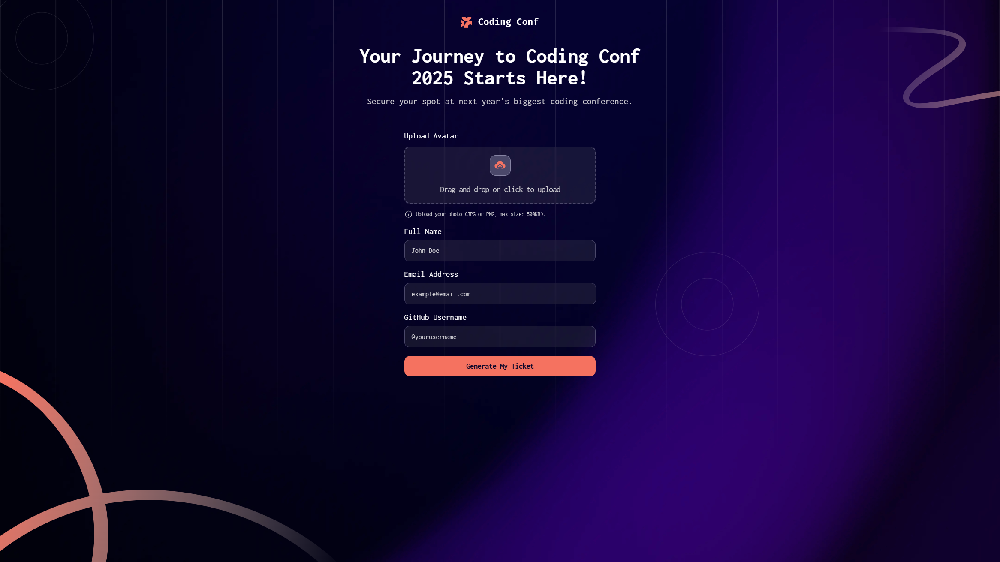

# Frontend Mentor - Conference ticket generator solution

This is a solution to the [Conference ticket generator challenge on Frontend Mentor](https://www.frontendmentor.io/challenges/conference-ticket-generator-oq5gFIU12w). Frontend Mentor challenges help you improve your coding skills by building realistic projects. 

## Table of contents

- [Overview](#overview)
  - [The challenge](#the-challenge)
  - [Screenshot](#screenshot)
  - [Links](#links)
- [My process](#my-process)
  - [Built with](#built-with)
  - [What I learned](#what-i-learned)
  - [Continued development](#continued-development)
  - [Useful resources](#useful-resources)
- [Author](#author)
- [Acknowledgments](#acknowledgments)

## Overview

### The challenge

Users should be able to:

- Complete the form with their details
- Receive form validation messages if:
  - Any field is missed
  - The email address is not formatted correctly
  - The avatar upload is too big or the wrong image format
- Complete the form only using their keyboard
- Have inputs, form field hints, and error messages announced on their screen reader
- See the generated conference ticket when they successfully submit the form
- View the optimal layout for the interface depending on their device's screen size
- See hover and focus states for all interactive elements on the page

### Screenshot



### Links

- Live Site URL: [Conference Ticket](https://conference-ticket.onrender.com/)

## My process

### Built with

- Semantic HTML5 markup
- CSS custom properties
- Flexbox
- CSS Grid
- Mobile-first workflow

### What I learned

During this project, I gained valuable insights into several key web development techniques:

- Implementing form validation techniques to enhance user experience and data integrity
- Creating a customizable file input with advanced features like drag and drop, preview, and error handling
- Mastering CSS techniques for positioning and styling images using background-image
- Managing state in a vanilla JavaScript application without relying on a framework
- Dynamically updating the DOM based on user interactions and handling asynchronous data fetching

```js
function validateFormData($email, $fullName, $githubUsername) {
  clearError('email');
  clearError('fullName');
  clearError('github')

  if (!$email.value.trim()) {
    setError('email', CONFIG.errorMessages.emailRequired)
  } else if (!CONFIG.emailPattern.test($email.value)) {
    setError('email', CONFIG.errorMessages.emailInvalid)
  }
}

function validateFile(file) {
  if (!file) {
    setError('avatar', CONFIG.errorMessages.fileRequired)
    return false
  }

  if (!CONFIG.allowedFileTypes.includes(file.type)) {
    setError('avatar', CONFIG.errorMessages.fileType)
    return false
  }

  if (file.size > CONFIG.maxFileSize) {
    setError('avatar', CONFIG.errorMessages.fileSize);
    return false
  }

  return true
}
```

### Continued development

In future projects, I plan to:

- Explore more advanced form validation techniques
- Improve accessibility features
- Implement more robust error handling
- Enhance user experience with more sophisticated UI interactions
- Learn about client-side and server-side form submissions

### Useful resources

- [MDN Web Docs](https://developer.mozilla.org/) - An invaluable resource for web development documentation
- [JavaScript.info](https://javascript.info/) - Comprehensive JavaScript learning resource

## Author

- Frontend Mentor - [@anglyh](https://www.frontendmentor.io/profile/yourusername)

## Acknowledgments

I would like to thank the Frontend Mentor community for providing this challenging project and the opportunity to improve my web development skills.